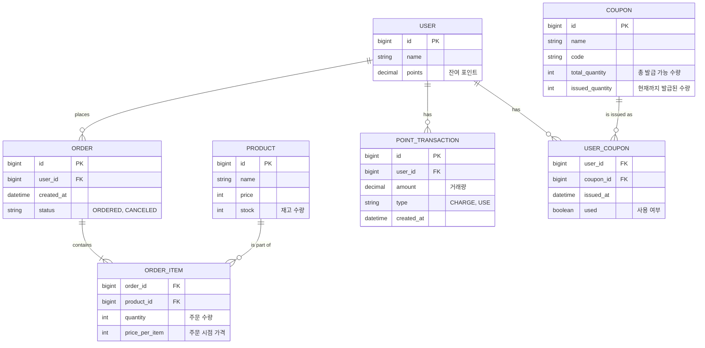
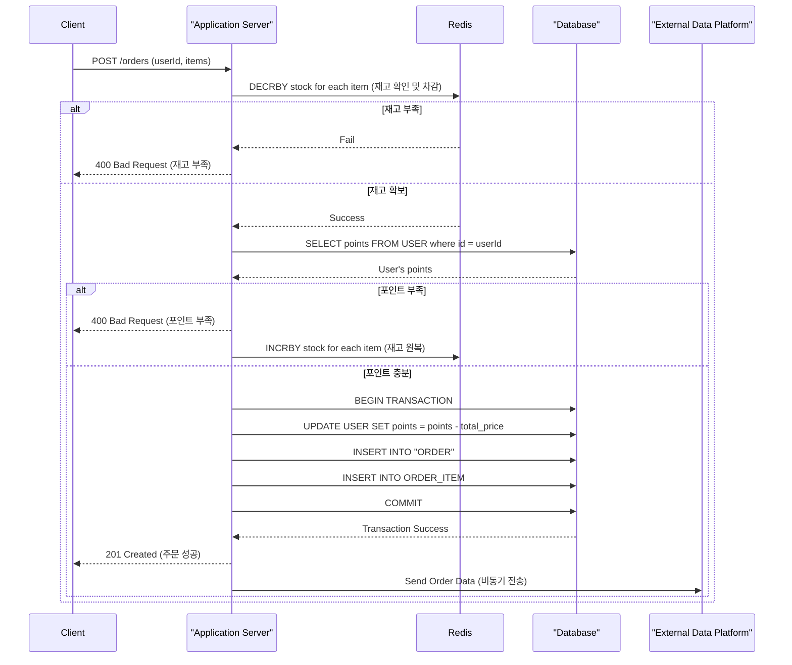

# e-커머스 서비스 시나리오 수행 과제

`요구사항.md`에 명시된 e-커머스 서비스 시나리오를 기반으로 과제를 수행합니다.

## 필수 과제 - 분석

### 1. 시나리오 선정

- **e-커머스 상품 주문 서비스 시나리오**

### 2. API 명세서

| 기능 | Method | Endpoint | 요청 (Body / Param) | 응답 | 설명 |
| --- | --- | --- | --- | --- | --- |
| **상품 목록 조회** | `GET` | `/products` | | `List<ProductResponse>` | 전체 상품 목록을 조회합니다. |
| **포인트 충전** | `POST` | `/points/charge` | `ChargeRequest` | `PointResponse` | 특정 사용자의 포인트를 충전합니다. |
| **포인트 조회** | `GET` | `/points/{userId}` | | `PointResponse` | 특정 사용자의 현재 포인트 잔액을 조회합니다. |
| **주문 및 결제** | `POST` | `/orders` | `OrderRequest` | `OrderResponse` | 상품을 주문하고 포인트로 결제합니다. |
| **선착순 쿠폰 발급** | `POST` | `/coupons/{couponId}/issue` | `CouponIssueRequest` | `CouponIssueResponse` | 선착순으로 쿠폰을 발급받습니다. |
| **인기 상품 조회** | `GET` | `/products/popular` | | `List<ProductResponse>` | 최근 N일간 가장 많이 판매된 상품 목록을 조회합니다. |

**DTO 예시**
- `ChargeRequest`: `{ "userId": 1, "amount": 10000 }`
- `PointResponse`: `{ "userId": 1, "points": 15000 }`
- `OrderRequest`: `{ "userId": 1, "items": [{ "productId": 1, "quantity": 2 }] }`

### 3. ERD (Entity-Relationship Diagram)

Mermaid 문법으로 작성된 ERD입니다.

### 4. 인프라 구성도

- **Client (Web/Mobile)**: 사용자가 서비스를 이용하는 인터페이스입니다.
- **DNS (Route 53)**: `*.example.com` 같은 도메인 요청을 Load Balancer로 라우팅합니다.
- **Load Balancer (ALB/NLB)**: API 서버들에 대한 트래픽을 분산하여 가용성과 안정성을 확보합니다.
- **API Server (WAS)**: Spring Boot 어플리케이션 서버. Auto Scaling Group으로 묶여 트래픽에 따라 인스턴스 수가 동적으로 조절됩니다. (심화 요구사항: 다수 인스턴스)
- **Database (RDBMS)**: 사용자, 상품, 주문 등 핵심 데이터를 저장하는 관계형 데이터베이스입니다. (e.g., AWS Aurora/RDS - MySQL/PostgreSQL)
- **Cache (In-memory Store)**: 상품 재고, 쿠폰 수량 등 동시성 제어가 중요한 데이터를 관리하고, 자주 조회되는 데이터를 캐싱하여 DB 부하를 줄입니다. (e.g., AWS ElastiCache - Redis)
- **Message Queue**: 주문 데이터를 외부 데이터 플랫폼으로 안정적으로 비동기 전송하기 위해 사용합니다. (e.g., AWS SQS/Kafka)
- **External Data Platform**: 주문 데이터를 수신하여 분석 및 처리하는 외부 시스템입니다.

## (선택) 심화 과제 - 실행

### 1. 시퀀스 다이어그램 (주문/결제)

가장 복잡한 `주문/결제` API의 처리 흐름입니다. 재고 차감의 동시성 문제를 해결하기 위해 Redis의 원자적 연산(atomic operation)을 활용합니다.

### 2. 마일스톤

| Milestone | 주요 내용 | 예상 기간 |
| --- | --- | --- |
| **1. 기본 API 및 환경 구축** | - 프로젝트 초기 설정 (Spring Boot) - ERD 기반 Entity 설계 - `상품 조회`, `포인트 충전/조회` API 개발 및 단위 테스트 | 2주 |
| **2. 핵심 기능 개발** | - `주문/결제` API 개발 - Redis를 이용한 재고관리 동시성 제어 - 데이터 플랫폼 연동(Fake 모듈) - 통합 테스트 작성 | 3주 |
| **3. 고급 기능 및 고도화** | - `선착순 쿠폰`, `인기 상품 조회` API 개발 - 인프라 구성(Docker) 및 배포 스크립트 작성 - API 문서 최종화 | 2주 |

### 3. 비즈니스 로직 기능 구현

- 상기 설계 문서를 기반으로 실제 비즈니스 로직 구현을 진행합니다.
- 각 기능 및 제약사항에 대해 단위 테스트를 반드시 작성합니다.
- 동시성 이슈 해결을 위해 `Pessimistic Lock`, `Optimistic Lock`, `Redis` 등 다양한 기술을 비교/검토하여 적용합니다.
