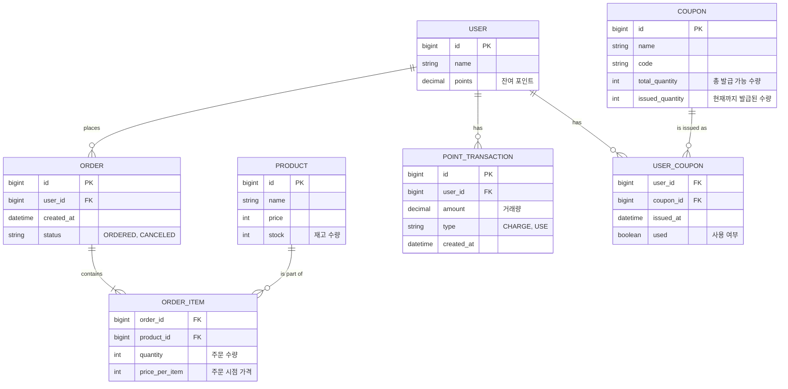

# ERD (Entity-Relationship Diagram)

## 다이어그램

## 테이블 정의

### USER
- 사용자의 기본 정보와 포인트 잔액을 관리합니다.

### PRODUCT
- 판매하는 상품의 정보와 재고를 관리합니다.
- `stock` 컬럼은 동시성 이슈를 최소화하기 위해 Redis와 같은 외부 저장소에서 관리될 수 있습니다.

### ORDER, ORDER_ITEM
- 사용자의 주문 정보와 주문된 각 상품의 정보를 저장합니다.
- `ORDER_ITEM`의 `price_per_item`은 주문 시점의 상품 가격을 저장하여, 추후 상품 가격이 변경되더라도 주문 내역에 영향을 주지 않도록 합니다.

### POINT_TRANSACTION
- 사용자의 모든 포인트 충전 및 사용 내역을 기록하여 추적이 가능하도록 합니다.

### COUPON, USER_COUPON
- 프로모션용 쿠폰의 총 수량과 발급된 수량을 관리하고, 어떤 유저가 어떤 쿠폰을 발급받았는지 관리합니다.
- `COUPON`의 `issued_quantity`는 동시성 제어가 필요합니다.

## 제약 조건 및 인덱스 전략
- **Foreign Key 제약조건**: `ON DELETE RESTRICT`, `ON UPDATE CASCADE`를 기본 정책으로 하여 데이터 무결성을 유지합니다.
- **Index**:
  - `USER(id)`: PK
  - `PRODUCT(id)`: PK
  - `ORDER(user_id, created_at)`: 특정 사용자의 주문 목록을 시간순으로 조회하는 경우가 많으므로 복합 인덱스를 적용합니다.
  - `USER_COUPON(user_id, coupon_id)`: 사용자가 특정 쿠폰을 이미 발급받았는지 빠르게 확인하기 위해 복합 유니크 인덱스를 적용합니다.
