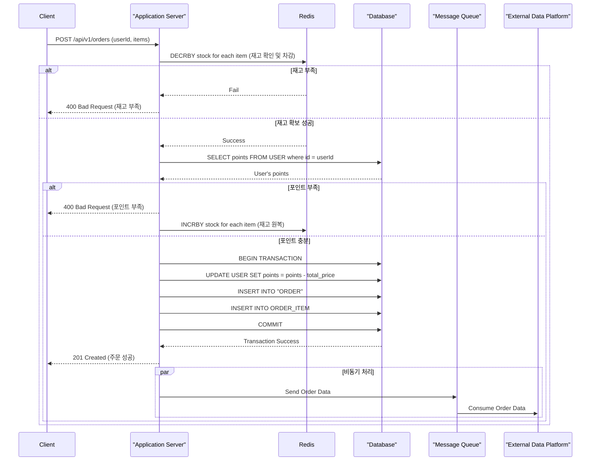

# 시퀀스 다이어그램

## 주문 및 결제

가장 복잡한 `주문/결제` API의 처리 흐름입니다. 재고 차감의 동시성 문제를 해결하기 위해 Redis의 원자적 연산(atomic operation)을 활용하며, 외부 시스템 연동은 메시지 큐를 통해 비동기적으로 처리합니다.

```mermaid
sequenceDiagram
    participant Client
    participant APIServer as "Application Server"
    participant Redis
    participant DB as "Database"
    participant MsgQueue as "Message Queue"
    participant DataPlatform as "External Data Platform"

    Client->>APIServer: POST /api/v1/orders (userId, items)
    APIServer->>Redis: DECRBY stock for each item (재고 확인 및 차감)
    
    alt 재고 부족
        Redis-->>APIServer: Fail
        APIServer-->>Client: 400 Bad Request (재고 부족)
    else 재고 확보 성공
        Redis-->>APIServer: Success
        APIServer->>DB: SELECT points FROM USER where id = userId
        DB-->>APIServer: User's points
        
        alt 포인트 부족
            APIServer-->>Client: 400 Bad Request (포인트 부족)
            APIServer->>Redis: INCRBY stock for each item (재고 원복)
        else 포인트 충분
            APIServer->>DB: BEGIN TRANSACTION
            APIServer->>DB: UPDATE USER SET points = points - total_price
            APIServer->>DB: INSERT INTO "ORDER"
            APIServer->>DB: INSERT INTO ORDER_ITEM
            APIServer->>DB: COMMIT
            DB-->>APIServer: Transaction Success
            
            APIServer-->>Client: 201 Created (주문 성공)
            
            par 비동기 처리
                APIServer->>MsgQueue: Send Order Data
                MsgQueue->>DataPlatform: Consume Order Data
            end
        end
    end
```
